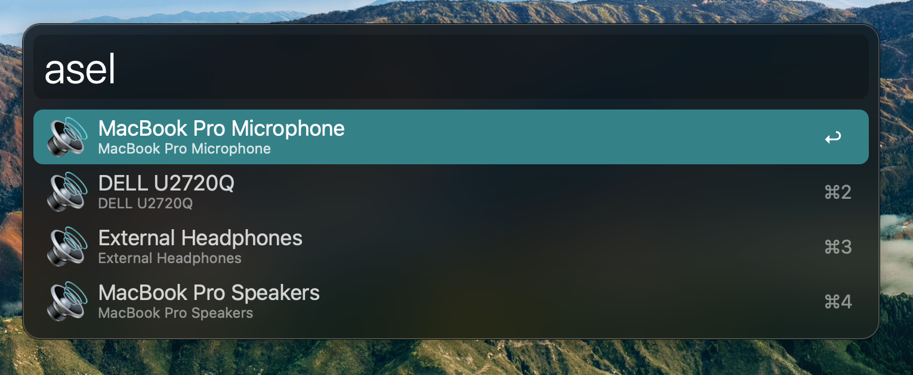

# Alfred Audio Switcher

Alfred workflow to quickly switch between audio devices.


**Credit:** [Switch Audio Input/Output Device using Alfred – AgileAdam.com](https://agileadam.com/2020/05/switch-audio-input-output-device-using-alfred/) for the idea, I've just made some icons and packaged it up.

## ⚠️ IMPORTANT ⚠️: install `switchaudiosource`

For this to you work, you need to use [Homebrew](https://brew.sh/) to install `switchaudiosource`:

```bash
brew install switchaudio-osx
```

## Switch to headphones

* Keyword: `ash`

Currently hard-coded to the audio device called "External Headphones"

## Switch to speakers

* Keyword: `asp`

Currently hard-coded to the audio device called "MacBook Pro Speakers"

## Switch to external device

* Keyword: `asx`

Currently hard-coded to the audio device called "DELL U2720Q", which happens to be my monitor.

**NOTE:** the macOS multimedia volume controls don't don't seem to affect the volume of external audio devices.

## Select audio source

* Keyword: `asel`

Presents a list of audio devices and lets you choose:



## Todo

- [ ] Change "monitor" to "external device" or something
- [ ] Use workflow variables instead of hard-coded strings for headphones, speakers, etc
- [ ] Use the select audio source workflow to assign devices to heaphones & speakers the first time
